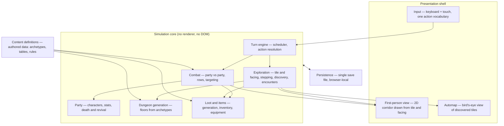

# High-Level Design: Deepcrawl

## Problem

Party-based dungeon crawlers in the Wizardry lineage — a fixed party, positional
turn-based combat, a dungeon that punishes overreach — are deep, slow-paced games
that suit short sessions well. Almost none of them are playable in a browser on a
phone. The ones that exist are either ports that assume a controller and an
uninterrupted hour, or shallow idle games wearing the genre's clothes.

Deepcrawl is that genre, built for the way people actually have time: a few
minutes at a stretch, on whatever device is in reach, with no install, no account,
and no lost progress when the tab closes.

## Approach

A turn-based, party-vs-party dungeon crawler delivered as an offline-capable PWA.

Four commitments carry the design.

### Nothing is real-time

No part of the game tests reflexes or timing. Combat, exploration, and every menu
advance only when the player acts. This is a design commitment first — the game is
about decisions — and it carries a large architectural dividend: the simulation is
a deterministic state machine, so it can be tested exhaustively and rendered by any
presentation layer without timing coupling.

### First-person, stepped, with the map in the corner

The dungeon is seen from the party's own eyes, drawn in 2D, in the manner of the
later Wizardry entries. The party occupies one tile facing one of four directions;
it steps forward a whole tile or turns ninety degrees, never between. An automap in
the corner shows the bird's-eye view, filling in as the party explores.

This is what makes the dungeon a place rather than a diagram. The first-person view
supplies the claustrophobia and the disorientation that give mapping its point; the
automap supplies the orientation that keeps disorientation from becoming tedium.
Neither view works without the other.

Stepped movement is the spatial counterpart of turn-based time: position is
discrete, facing is discrete, and the world advances a step at a time. Facing and
the set of tiles the party has seen are therefore simulation state, not rendering
detail — the automap draws what the party has actually observed, so what has been
seen must be recorded where the save can hold it.

### One party, one save, real consequences

A single persistent save file holds one party across a whole campaign. Characters
can die; death is recoverable at a cost, not erasing. The player lives with the
results of their decisions rather than restarting from a clean slate, which is
what makes the decisions weigh anything.

### Procedural content within authored guidelines

Floors, enemy compositions, and loot are generated rather than hand-placed, but
generation runs inside constraints authored as data — floor archetypes, encounter
budgets, loot tables, affix rules. Generation supplies variety; the authored
guidelines supply coherence. Neither pure hand-authoring (an unsustainable content
burden for one developer) nor unconstrained generation (incoherent dungeons) is
acceptable alone.

## Target Users

- **The short-session player.** Has five to fifteen minutes, on a phone, standing
  up. Needs the game to resume exactly where it was and to be fully playable with
  thumbs. Will not tolerate losing progress to a closed tab.
- **The systems player.** Comes for the party-building and the positional combat
  math. Wants classes, equipment, and abilities that interact, and wants to
  understand why an encounter went badly. Will read numbers.
- **The developer.** Deepcrawl is built solo under Linked-Intent Development. The
  architecture has to stay legible and testable enough that a session picked up
  weeks later can be understood from the docs and the specs alone.

## Goals

- A complete campaign loop: form a party, descend, fight, loot, return, improve,
  descend deeper.
- Combat where front/back positioning, class roles, and ability choice visibly
  decide outcomes.
- A dungeon worth mapping: navigable from the first-person view, with an automap
  that records what the party has seen and makes the unexplored obvious.
- An identical play experience by keyboard and by touch — neither is a degraded
  port of the other.
- Fully playable offline after first load; progress survives a closed tab, a
  refresh, and an app update.
- A simulation layer testable without a renderer, so EARS specs assert game
  behavior directly rather than asserting through the UI.

## Play Objectives

What the design should encourage players to *do*. These are not software
requirements: no spec asserts them and no test can prove them. They are the
behaviours the segments exist to produce, and they are the standard a proposed
mechanic is judged against — a mechanic that serves none of them needs another
justification.

- **Early floors stay worth revisiting.** A player who has reached the tenth floor
  should still find reasons to walk the second. Falsified when optimal play is to
  descend and never look back.

## Non-Goals

- **Real-time or action combat.** No timing windows, no reaction tests, no ATB.
- **Roguelike run structure.** No permadeath, no run-scoped meta-progression, no
  wiping the save on a party loss.
- **Free-grid tactical combat.** Positioning is front row / back row, not an
  arbitrary battlefield. Rejecting the grid is what keeps combat readable on a
  phone and keeps enemy AI tractable.
- **Multiplayer or any server component.** The game is a static PWA; there is no
  backend, no account, and no cloud save.
- **3D rendering.** The first-person view is drawn in 2D with PixiJS — layered
  sprites and scaled art, not a 3D scene graph, not raycasting into a texture-mapped
  world.
- **Free-roaming movement.** No analog position, no turning through intermediate
  angles, no strafing off the tile grid. The party is on a tile, facing a direction.
- **Mod support and user-authored content.**

## Tenets

Ordered — when two conflict, the higher one wins.

- **Depth over breadth.** When choosing between another system and more
  interaction between the systems that already exist, deepen what is there. Few
  mechanics that combine richly beat many that each do one thing.
- **Thought over reflex.** When an interaction could reward either a quick
  reaction or a good decision, make it reward the decision. Nothing in Deepcrawl
  is a test of timing.
- **Setbacks, not erasure.** When a failure state could either destroy progress or
  impose a recoverable cost, make it recoverable. The single save file means the
  player lives with consequences; it should never mean they lose everything.

## System Design

The project splits into a **simulation core** — pure data and deterministic
functions, no renderer — and a **presentation shell** that draws simulation state
and translates input into simulation actions. The boundary is one-directional: the
simulation never imports PixiJS and never touches the DOM.

**Turn engine.** Owns the scheduler and action resolution. Everything in the game
— a step down a corridor, a sword swing, a menu confirmation that costs time — is
an action submitted to the engine, which advances state deterministically.

**Combat.** Party-vs-party resolution. Both sides occupy a front row and a back
row; row determines reach, targeting weight, and exposure. Owns initiative,
targeting, ability effects, and damage.

**Party.** The player's characters: stats, classes, progression, equipment
loadout, row assignment, and the alive / incapacitated / dead / revived state
machine. A party holds at most five characters, with at most three in either row —
so a full party is three and two, never three and three.

**Exploration.** The party's tile and facing, stepping and turning, and the record
of which tiles have been discovered. Also encounter triggering, interactables, and
the descend/return loop. Discovery state is owned here rather than by the automap:
the automap is a view of what the party has seen, and what the party has seen has
to survive a save.

**Dungeon generation.** Produces a floor from an archetype plus a seed. Seeded and
reproducible, so a floor can be regenerated identically and tested. Floors form a
graph rather than a stack: a floor's connectors name target floors by id, so one
floor may lead to several, and depth is a label rather than a computed property.
Floors are generated once and persist for the campaign. The dungeon is not simulated
while the party is away; a floor is rearranged on return in proportion to the time
elapsed, so a known map stays accurate about its layout and unreliable about what
occupies it.

**Loot and items.** Item generation within loot tables and affix rules; inventory
and equipment.

**Content definitions.** The authored guidelines generation runs inside — floor
archetypes, enemy rosters, encounter budgets, loot tables, ability definitions.
Data, not code.

**Persistence.** One save file in browser storage, holding the full campaign
state. The schema is versioned; an app update must not orphan an existing save.

**Input.** Keyboard and touch both produce the same action vocabulary; the
simulation cannot tell which was used.

**First-person view.** Draws the corridor ahead from the party's tile and facing,
in 2D — layered sprites for walls, doors, and features at each depth step. Consumes
the floor layout and the party's position; owns no game state of its own.

**Automap.** Draws the bird's-eye view of the tiles exploration has marked
discovered, with the party's position and facing on it. A second view of the same
simulation state, not a second model of the dungeon.

Both views are stateless with respect to game logic — the simulation is the single
source of truth, and the two views must never disagree about where the party is.

Each component above is a candidate arrow segment with its own LLD, drafted when
work first reaches it rather than all at once.

## Key Design Decisions

| Decision | Alternatives considered | Rationale |
|---|---|---|
| Everything turn-based; nothing real-time | Real-time action; hybrid ATB | The game is about decisions, not execution. Also makes the simulation a deterministic state machine — testable without a renderer, which the development workflow depends on. |
| Single persistent save, campaign-shaped | Roguelike runs with permadeath; multiple save slots | Consequences have to persist for decisions to weigh anything. One slot rather than many keeps the player from save-scumming around the consequence. |
| Front row / back row positioning | Free tactical grid (XCOM/FFT); no positioning at all | Positioning matters for reach and exposure without the UI cost of a grid on a phone screen, and without the AI cost of pathfinding and cover. No positioning at all would flatten combat into a stat comparison. |
| Party of five, at most three per row | Six, filling both rows; four, one row of three plus one reserve | Six makes composition a non-choice — both rows fill and every party looks alike. Five cannot fill both rows, so each party is a live decision about whether to weight the front for durability and reach or the back for casters and ranged attacks. An odd size also removes mirror symmetry between the rows. |
| Death recoverable, at a cost | Permadeath; death impossible | Follows the *setbacks, not erasure* tenet. A death the player can undo for free is not a consequence; one they cannot undo at all contradicts the single-save structure. |
| Procedural generation constrained by authored data | Fully hand-authored floors; unconstrained generation | Hand-authoring every floor is unsustainable solo; unconstrained generation produces incoherent dungeons. Authored archetypes and tables bound the generator's output space. |
| First-person 2D view plus a corner automap | Top-down view of the whole floor; first-person with no automap; 3D or raycast rendering | The first-person view makes the dungeon a place to be lost in, which is the genre's appeal; the automap keeps being lost from becoming tedious. A top-down view gives orientation for free and loses the tension. 3D is disproportionate for a 2D sprite game and costs mobile performance. |
| Facing and discovered tiles are simulation state | Treating facing as camera state and discovery as automap state | The automap must show what the party actually saw, and that has to survive a save. Putting either in the presentation layer would mean the renderer owns state the save file needs. |
| Simulation/presentation split, one-directional | Game logic living inside Pixi scene objects | Lets specs assert game behavior directly rather than through the UI, and lets the first-person view and the automap draw from one source that cannot disagree with itself. Enforced by the simulation layer importing no renderer. |
| Browser-local save, no backend | Server-side save with accounts | The project deploys as a static PWA to GitHub Pages. A backend would add accounts, hosting cost, and an online requirement, all against the offline-first goal. Cost: the save is device-local and losable, which makes export/import the mitigation. |

## Success Metrics

Falsification signals — conditions under which Deepcrawl would be judged broken:

- A player cannot complete a descend → fight → loot → return → improve cycle
  without touching a keyboard, or cannot complete it without touching a screen.
- The same seed and the same action sequence produce different simulation state on
  two runs.
- Any file in the simulation layer imports PixiJS or references the DOM.
- A deployed app update leaves an existing save file unreadable.
- The game does not resume where it left off after the tab is closed and reopened.
- The automap shows tiles the party has never seen, or omits tiles it has — or it
  and the first-person view disagree about where the party is standing or facing.
- A player cannot navigate the dungeon from the first-person view alone, or cannot
  tell from the automap where they have not yet been.
- Combat outcomes are decided by stats alone — positioning and ability choice make
  no observable difference.

## References

- Genre prior art: the later Wizardry entries — first-person stepped exploration
  with a corner automap, and row-based party combat. Etrian Odyssey for mapping as
  a pleasure in itself; Darkest Dungeon for recoverable-loss design.
- Development process: Linked-Intent Development — https://linked-intent.dev
- Live deployment: https://mjschleckser.github.io/deepcrawl/
