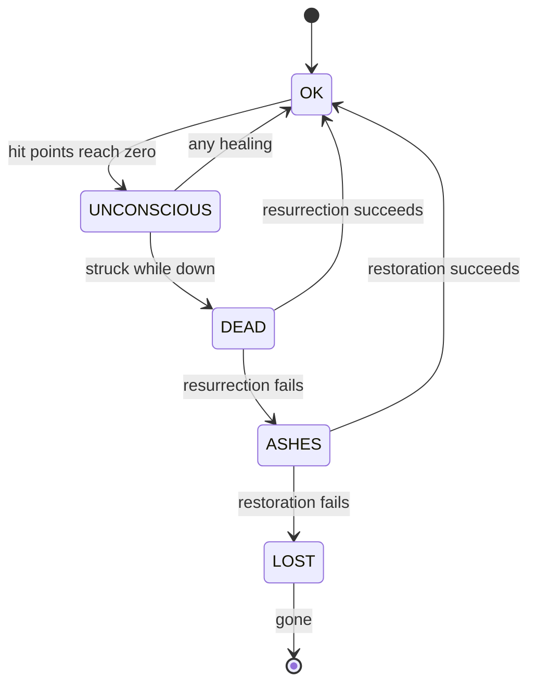

# The Party

## Context and Design Philosophy

The party is the thing the player actually owns. Characters, what they can do, where
they stand, and what has happened to them all live here — and because both combat and
exploration change them, this segment is the only writer.

Three principles shape the design.

**One owner, many callers.** A potion drunk in a corridor and a mace swung in a fight
both change a character's hit points. Neither segment writes the field. Both call an
operation here, so the floor at zero, the death chain, and the five-member and
three-per-row limits are enforced in exactly one place, no matter what caused the
change.

**Characters are what they have done.** Progression is not a number awarded for
surviving; it is a record of use. A character who has spent a campaign picking locks
is good at picking locks, and class governs what they may learn and how fast, not what
they are. This is why class can change and skill cannot be undone.

**Advancement always costs something scarce.** In combat the clock is stopped, so
advancement is bounded by what the enemy was worth. Outside it the clock runs, so
training costs ticks, and ticks cost food and light. There is no action in the game
that improves a character for free, because an action that did would become the only
action worth taking.

## What This Segment Owns

| | Owned by the party | Owned elsewhere |
|---|---|---|
| Characters | attributes, skills, condition, class, row | — |
| Equipment | which item sits in which slot | items define what an item *is* |
| Skills | ranks, advancement, what is unlocked | combat resolves what an ability does |
| Condition | the state machine and its transitions | combat and exploration cause transitions |
| Attributes | the six scores | weapons decide which score they draw on |

## The Roster

A party holds at most five characters. At most three stand in the front row and at
most three in the back, so a full party is three and two, never three and three — the
asymmetry is the point, and it makes every composition a standing decision.

A row assignment is part of a character, not a separate seating chart, so a character
cannot be in two places or nowhere.

## Attributes

Six scores, fixed at creation and moved only by rare effects.

| Attribute | What it contributes |
|---|---|
| **Might** | +4% damage per point over 10, for any weapon that names it |
| **Constitution** | hit points; resisting poison and disease |
| **Dexterity** | step cost, turn order, fleeing, +2 defence per point over 10 |
| **Intellect** | spell slots at the lower ranks; spell magnitude and duration |
| **Perception** | +2 accuracy per point over 10; finding traps and secret doors |
| **Resolve** | resisting fear and charm; holding a spell when struck mid-cast |

Each attribute has its own contribution rather than a blanket rule applied to whichever
one a weapon names. Might is the damage attribute by default, but *which* attribute a
weapon draws on for damage is a property of the weapon: a dagger with the *finesse*
property names Dexterity, and still trains Blade. Accuracy is not open to that
substitution — it is always weapon skill and Perception — because letting one attribute
raise both how often a character connects and how hard would compound it twice in the
same swing.

Attributes are fixed at creation and moved only by a trainer, rarely and at cost. They
are what a character *is*; skills are what they have done.

### Hit points

```
maximum hit points = class base × (1 + 0.05 × (Constitution − 10))
```

| Class | Base |
|---|---|
| Fighter | 30 |
| Cleric | 26 |
| Thief | 22 |
| Mage | 18 |

**Hit points never grow through play.** There are no character levels to grow them
with, and tying them to a skill rank would mean practising a weapon made a body harder
to kill. Getting harder to kill instead means better armour, better healing, better
positioning, and — rarely — buying Constitution from a trainer.

This has a consequence worth being deliberate about: the survivability curve across a
campaign runs entirely through armour, defence, and healing, so enemy damage can stay
roughly flat as floors deepen instead of chasing an ever-growing pool. A deep floor
stays lethal to a veteran party in a way it would not if hit points had quietly
tripled on the way down.

Constitution is multiplicative rather than flat so that the classes stay distinct at
every score: a tough fighter gains more absolute hit points than a tough mage, and the
gap between the two holds at roughly 1.7× from Constitution 6 to 18.

## Skills

A skill is a named capability with a rank. Ranks unlock abilities: some active, some
passive. Skills are grouped for presentation only; nothing depends on the grouping.

| Group | Skills |
|---|---|
| Weapon | Blade, Blunt, Polearm, Bow |
| Defence | Heavy Armour, Light Armour, Shield |
| Arcane | Evocation, Alteration |
| Divine | Healing, Restoration |
| Stealth | Detection, Disarm, Locks |
| Survival | Cartography, Cooking, Foraging |

Several of these are the missing owners of behaviour other segments already describe.
**Alteration** owns the light spell exploration has been designing around. **Restoration**
owns resurrection, which the death chain below requires. **Detection** owns trap and
secret-door finding, which exploration has been calling into a segment that did not
exist. **Cartography** owns mapping range, deferred in exploration since sight was
built.

The skill list itself is content data. Adding a skill is authoring, not designing.

### Advancement

Every enemy is worth a fixed amount of skill experience. When an encounter ends, that
amount is **divided equally among the distinct skills the party used during it** — not
weighted by how often each was used.

A skill counts as used whether or not it worked. A swing that missed and a spell that
was resisted both taught something; only never trying teaches nothing.

The pot **grows with the number of distinct skills used**, up to a ceiling, and is then
split equally. Growing it means a party is not punished for using its whole kit, which
a flat pot would do — five skills each taking a fifth would make the optimal play to
fight with one. The ceiling is what keeps the fight unfarmable: past a handful of
skills there is nothing further to gain, so a party cannot inflate the pot by dragging
a fight out long enough to cycle through everything it owns.

Twenty swings and one swing still earn the same, because the pot belongs to the enemy
rather than to the action. A specialist still advances faster in their specialty than a
dabbler does in any of theirs, because fewer skills divide their share.

Fighting things far below the party's level is not forbidden, only unrewarding: a weak
enemy carries a small pot, so farming decays on its own without a rule against it.
That leaves it available to a party that is underlevelled or rebuilding after a
disaster, which is when it should be available.

Outside combat a skill advances through use, bounded by the clock: searching, cooking
and mapping all cost ticks, and ticks cost food and light.

#### What a rank costs

Ranks run from 1 to **10**, and each one costs more than the last:

```
experience to go from rank r to rank r + 1 = 300 × r
```

| From → to | Cost | Running total |
|---|---|---|
| 1 → 2 | 300 | 300 |
| 2 → 3 | 600 | 900 |
| 5 → 6 | 1,500 | 4,500 |
| 9 → 10 | 2,700 | 13,500 |

A rising cost is what makes farming decay on its own. A floor-one warband is worth
about 42 to the pot, which reaches a fighter's Blade as roughly 84 once the class rate
is applied — some seven warbands for rank 2 → 3, and thirty-two for rank 9 → 10. The
same rank against floor-appropriate enemies costs seven or eight fights at any point in
the campaign, because the pot grows with the floor while the cost grows with the rank.
Early floors therefore stay *available* to a party that is underlevelled or rebuilding
after a disaster, and stay *slow* for one that is not, without a rule forbidding
anything.

The cap of 10 is what lets content be calibrated at all: it fixes the top of the
accuracy and damage curves, so the deepest floor can be built against a known ceiling
rather than an open-ended one.

### Class

A class is not what a character *is*. It governs which skills they may learn and how
fast each advances — a rate multiplier per skill, and a set they cannot train at all.

| Class | Trains fastest | Cannot train |
|---|---|---|
| Fighter | weapons, heavy armour, shield | arcane, divine |
| Mage | evocation, alteration | heavy armour, shield |
| Cleric | healing, restoration, blunt | arcane, blade |
| Thief | detection, disarm, locks, blade | heavy armour, divine |

A character may change class at a trainer on meeting its requirements. **Ranks already
earned are kept**, including in skills the new class cannot train — they simply stop
advancing. A character is the sum of what they have done, and changing career does not
unmake it.

## Condition

Five states, and the path between them runs one way under pressure and the other way
only at a cost.



An unconscious character is still in the party, occupying their row, taking no action
and defending nothing. Another character may swap places with them, but that costs an
action — dragging a body out of the front rank is work, not bookkeeping. A dead one is
carried. Each recovery costs more than the last and can fail, and each failure
degrades the character one step further.

Transitions resolve per character rather than per round. Combat resolves selected
actions one character at a time in descending Dexterity, ties going to the party and
ties within the party settled by a fixed order of position — so a character at zero hit
points who is struck before their healer acts goes down, and the healing that follows
finds them unconscious. Dexterity is this segment's; the ordering rule is combat's, and
is recorded here only because the condition chain is meaningless without it.

This is the steepest reading of *setbacks, not erasure*, and it is deliberately steep:
because skills are earned by use rather than bought with experience, a character who is
lost takes with them hours of specific, unrepeatable use. A party retreats from a bad
fight because of what it would cost to lose someone, not because of a number.

The tenet holds at the level it was written: a campaign cannot be erased, and a party
that loses a member rebuilds. One character is not everything.

## Party Operations

Every change to a character goes through an operation, and nothing outside this
segment writes a character field. The operations are few on purpose.

| Operation | Called by | Enforces |
|---|---|---|
| `applyDamage` | combat, traps | the floor at zero, and the slide into unconsciousness or death |
| `applyHealing` | combat, exploration | the ceiling at maximum, and waking the unconscious |
| `attemptRevival` | camp, town, a hired cleric, a consumed scroll | the condition chain, and degrading on failure |
| `swapPlaces` | combat | that the swap costs the actor their action |
| `assignRow` | the player, through the party screen | at most three a row, at most five in all |
| `equip` | the player | slot rules, and what a class may wield |
| `awardEncounter` | combat | the pot divided equally among skills used |
| `trainSkill` | camp | the clock's cost, and what a class may train |
| `changeClass` | town | requirements met, ranks kept |

### Who can bring someone back

Restoration is a skill, but a party that lost its only Cleric must not be locked out of
recovery for the rest of the campaign. Four routes exist, and they are deliberately
redundant:

- a Cleric in the party, using Restoration
- a temple in town, for a fee
- a wandering cleric met in the dungeon, for a steeper fee
- a one-use scroll or relic, bought from a wandering merchant

The party's own Cleric is the cheapest and the only one available at depth without
luck. The rest are what stop a bad run becoming an unrecoverable spiral.

### Starting ranks

No skill begins at zero that a character is expected to use. Every class starts with a
set of **base skills at rank 1** that all classes share, plus its own set at rank 1 or
higher. A fresh Thief can already detect something; a fresh Cleric can already attempt
a revival. A generator that produced a party unable to play its first hour would have
failed.

## Persistence

The whole roster is saved: every character's attributes, skills and ranks, condition,
row, equipment slots, class, and accumulated skill experience. A lost character is
kept in the save as a record rather than deleted, because a campaign should be able to
show what it cost.

## Standing Orders

A character carries the order list combat reads when their turn comes. It is a field on
the character for the same reason their skills are: it belongs to the person, survives
every encounter, and goes with them whatever party they are in.

What a rule may say, and how the list is read, is combat's. This segment holds it and
hands it over.

## Decisions & Alternatives

| Decision | Chosen | Alternatives Considered | Rationale |
|---|---|---|---|
| Hit-point growth | None: class base and Constitution, fixed for life | Growth with the best armour skill rank; a Toughness skill trained by being hit; character levels | Every growth mechanism needs enemy damage to grow alongside it, and a campaign that inflates both ends changes nothing except the size of the numbers. Fixed hit points keep a deep floor genuinely lethal to a veteran, and route survivability through armour, healing and positioning, which are decisions made in the fight. |
| Constitution's shape | Multiplicative, 5% per point over 10 | Flat hit points per point | Flat would make a point of Constitution worth the same to a mage as to a fighter, compressing the classes together at high scores until a tough mage outlasts a frail fighter. |
| Rank cost | 300 × r to leave rank r, capped at rank 10 | A flat cost per rank; a geometric curve | A flat cost makes floor one exactly as efficient at rank 9 as at rank 2, so nothing ever pulls a party downward. A geometric curve makes the last ranks a grind measured in hundreds of fights. A linear-cost curve decays farming gently while leaving it available. |
| Rank ceiling | 10 | Uncapped ranks | Without a ceiling there is no top to the accuracy and damage curves, and the deepest floor cannot be built against anything. |
| Who writes character state | Only this segment, through named operations | Combat and exploration writing fields directly | Both legitimately change hit points. One owner means the zero floor, the death chain and the roster limits are enforced once rather than in every caller. |
| Progression | Skill ranks earned by use | Experience points and character levels | A character should be what they have done. It also makes class a governor rather than an identity, which is what allows changing class without discarding a character. |
| Combat advancement | A pot per enemy, growing with distinct skills used up to a ceiling, split equally | Per-action gain; a flat pot split equally; diminishing returns per action | A pot fixed by the enemy is what makes prolonging a fight worthless. Growing it with distinct skills stops a flat split punishing a party for using its whole kit; the ceiling stops a party inflating it by dragging the fight out until everyone has touched everything. |
| A missed attack | Counts as use of the skill | Only successful use counting | Trying and failing is how anyone learns. Requiring success would also make advancement fastest against the weakest enemies, which is the opposite of what the pot is for. |
| Starting ranks | Shared base skills at rank 1, plus class skills at rank 1 or better | Everything beginning at zero | A party that cannot detect, heal or fight on its first descent has no first hour. |
| Reviving without a Cleric | Town temples, wandering clerics, and one-use scrolls | Restoration being the only route | Losing the only Cleric would otherwise spiral into an unrecoverable campaign, which the tenet forbids at the campaign level. |
| An unconscious character in the front rank | Can be swapped out, but it costs the swapper their action | Free reassignment; no reassignment at all | Free swapping would make going down nearly costless. Forbidding it would make a front-rank casualty a fixed liability for the whole fight. |
| Low-level farming | Allowed, and unrewarding on its own terms | Forbidding it with a level cutoff | A small pot is its own disincentive, and the option should stay open to a party rebuilding after a disaster — which is exactly when a cutoff would bite hardest. |
| Attributes and skills | Deliberately unbound; weapons declare what they draw on | Each skill governed by a fixed attribute | Binding them flattens the difference between a dagger and a mace. A finesse weapon drawing on Dexterity while still using Blade is the kind of nuance that makes equipment interesting. |
| Death chain | Unconscious, dead, ashes, lost, with failure degrading | Always-recoverable death; a chain with no final stage | Skills earned by use make a loss unbuyable, so the threat has real weight. The tenet holds at the campaign level: losing a character is a setback, not erasure. |
| Class change | Keeps every rank, including untrainable ones | Resetting or penalising skills on change | A character is the sum of what they have done. Ranks in skills the new class cannot train simply stop advancing. |
| A lost character | Kept in the save as a record | Deleted from the roster | A campaign should be able to show what it cost. |

## Open Questions & Future Decisions

### Resolved

1. ✅ **This segment is the only writer** of character state; everyone else calls an operation.
2. ✅ **Progression is skill rank earned by use**, not experience and levels.
3. ✅ **An enemy carries a pot** that grows with the distinct skills used against it up to a ceiling, then divides equally.
4. ✅ **A miss counts as use.** Trying and failing still teaches.
5. ✅ **Class sets starting ranks**: shared base skills at 1, plus its own at 1 or higher.
6. ✅ **Swapping with an unconscious ally costs an action.**
7. ✅ **Revival has four routes** — party Cleric, town temple, wandering cleric, one-use scroll.
8. ✅ **Attributes are not bound to skills**; weapons declare which attribute they draw on.
9. ✅ **The death chain degrades on failed recovery**, and a character can be lost.
10. ✅ **Class governs availability and rate**, and changing it keeps every rank already earned.
11. ✅ **At most five characters, at most three a row.**
12. ✅ **A lost character stays in the save** as a record.

### Deferred

1. **Ability definitions.** Ranks unlock abilities, but what an ability *does* is combat's, and combat does not exist. The unlock mechanism is designed; the abilities are not.
2. **Rank thresholds and rates.** How much experience a rank costs, and what a class rate multiplier actually is, are unauthored — content data with no content yet.
3. **Enemy pot values.** What an enemy is worth belongs with enemies, which do not exist.
4. **Character creation.** How attributes are set at the start — rolled, allocated, or fixed by class — is unspecified.
5. **The pot ceiling.** That the pot stops growing past a handful of distinct skills is settled; where the ceiling sits is content data and untuned.
6. **Equipment slots.** Which slots exist, and what a class may wield, waits on the items segment.
7. **Trainers and towns.** Class change and training need a place to happen; no town segment exists.
8. **Carrying the dead.** A dead character is carried, but whether that costs the party anything — weight, speed, morale — is unaddressed.

## References

- `docs/high-level-design.md` — the five-member party, the rows, and *setbacks, not erasure*.
- `docs/intent/exploration/exploration-design.md` — the operations exploration calls, and the skills that own its deferred behaviour.
